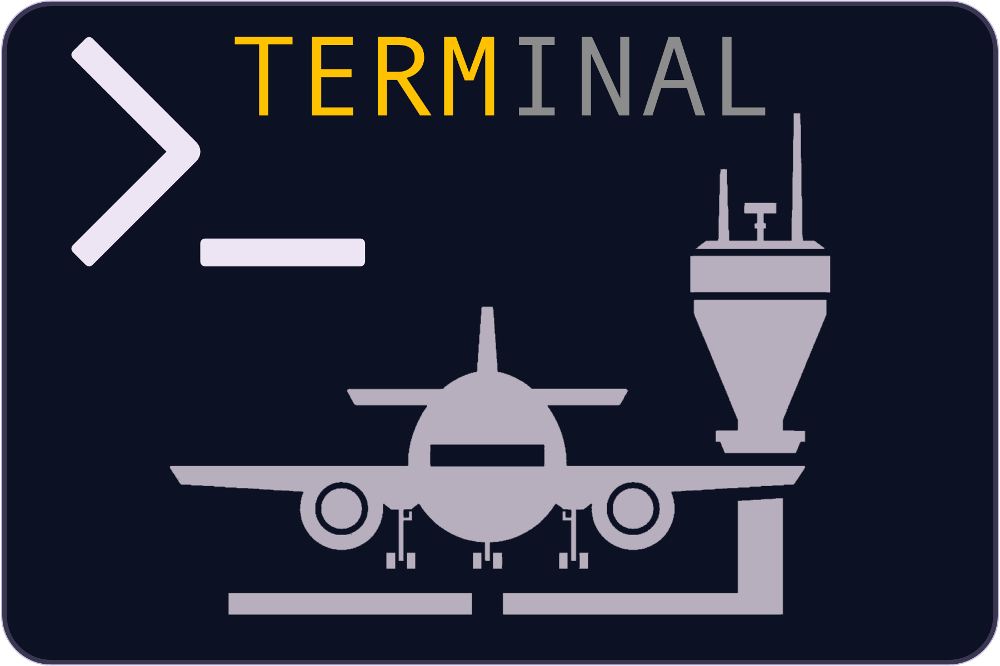

<!-- panvimdoc-ignore-start -->

<p align="center">
  <h2 align="center">terminal.nvim</h2>
</p>
<p align="center">
  
</p>
<p align="center">The Neovim Terminal Manager</p>

# Terminal.nvim

<!--toc:start-->

- [Terminal.nvim](#terminalnvim)
  - [Installation](#installation)
  - [Setup](#setup)
    - [Default config](#default-config)
  - [API](#api)
  - [Keymaps](#keymaps)
    - [Example mappings](#example-mappings)
  - [Commands](#commands)
  - [Terminal objects](#terminal-objects)
    - [Named Terminals Examples](#named-terminals-examples)
      - [IPython:](#ipython)
      - [Lazygit:](#lazygit)
      - [Htop:](#htop)
  - [Tips](#tips)
    - [Useful terminal mappings](#useful-terminal-mappings)
    - [Auto insert mode](#auto-insert-mode)
    - [terminal window highlight](#terminal-window-highlight)
    - [Statusline integration](#statusline-integration)
  - [Donate](#donate)
  <!--toc:end-->

## Installation

```lua
use({
    'rebelot/terminal.nvim',
    config = function()
        require("terminal").setup()
    end
})
```

---

## Setup

```lua
require("terminal").setup(<config?>)
```

Set up the plugin with the prvided `config` table (optional).
A call to this function is always required.

### Default config

```lua
{
    layout = { open_cmd = "botright new" },
    cmd = { vim.o.shell },
    autoclose = false,
}
```

- **`config.layout`**: Specify the layout of the terminal window.

  - Type: `table`
  - Default: `{ open_cmd = "botright new" }`

    `open_cmd` is the Vim command used to create the new buffer and window.
    If set to `"float"`, the terminal will be opened in a new floating window.
    When `open_cmd = "float"`, `layout.height` and `layout.width`
    are used to determine the height (lines) and width (columns)
    of the floating window.
    Values `<= 1` are interpreted as percentage of screen space.

- **`config.cmd`**: Default command for new terminals

  - Type: `table|string` passed to `termopen` (`:h jobstart()`)
  - Default: `{ vim.o.shell }`

- **`config.autoclose`**: Automatically close terminal window when the process exits (on `TermClose`).
  - Type: `bool`
  - Default: `false`

---

## API

- **`set_target(index)`**:

  - Description: Set the `index` terminal as the target for other actions.
  - Params:
    - `index` (`integer`): Terminal index.

- **`cycle(step?)`**:

  - Description: Cycle between active terminals.
  - Params:
    - `step` (`integer`): Increment number for cycling (Defalut: `1`)

- **`run(cmd?, opts?)`**:

  - Description: Run a command in terminal with given options. If no command
    is provided, user will be prompted to insert one;
    If `cmd` is an empty string, `config.cmd` will be used.
  - Params:
    - `cmd` (`table|string`): command to be executed by the terminal.
    - `opts` (`table`): options to be passed to `termopen`

- **`open(index?, layout?, force?)`**:

  - Description: Open a terminal with given layout.
  - Params:
    - `index` (`integer`): terminal index
    - `layout` (`table`): layout spec
    - `force` (`bool`): Force opening the terminal window even if it already visible in the current tab.

- **`close(index?)`**:

  - Description: Close a terminal window.
  - Params:
    - `index`(`integer`): terminal index

- **`kill(index?)`**

  - Description: Kill a terminal job and close its window.
  - Params:
    - `index` (`integer`): terminal index

- **`toggle(index?, layout?, force?)`**

  - Description: Open a terminal with given layout, or close its window
    if it's visible in the current tab (unless `force` is `true`).
  - Params:

    - `index` (`integer`): terminal index
    - `layout` (`table`): layout spec
    - `force` (`bool`): Force opening the terminal window even if it already visible in the current tab.

- **`send(index?, data)`**:

  - Description: Send text to the terminal.
  - Params:
    - `index` (`integer`): terminal index
    - `data` (`table|string`): Text to be sent to the terminal via `chansend()`

- **`current_term_index()`**:

  - Description: Get the index of the terminal in the current window.

- **`get_current_term()`**:

  - Description: Get the terminal object displayed in the current window.

- **`move(index?, layout)`**:

  - Description: Change the layout of the selected terminal, permanently.

---

## Keymaps

Keymaps can be set up using the API defined in `terminal.mappings`. When called
with arguments, each keymap API function returns a pre-loaded function with
given arguments. Otherwise, the corresponding terminal function will be called
with default arguments. All keymap functions support a count by default, so
that, for instance, `2<leader>to` will toggle the terminal with index #2.

- `[count]operator_send {motion}`: Send text captured by `{motion}` to `[count]` terminal
- `[count]["x]register_send`: Send text captured in register `"x` to `[count]` terminal
- `[count]send[(data)]`: Send `data` to `[count]` terminal. May preload `send`.
- `[count]cycle_next`: Cycle next `[count]` terminals.
- `[cunt]cycle_prev`: Cycle previous `[count]` terminals.
- `[count]toggle[(layout?, force?)]`: Toggle `[count]` terminal. May preload `toggle()`.
- `[count]open[(layout?, force?)]`: Open `[count]` terminal. May preload `open()`.
- `[count]close`: Close `[count]` terminal.
- `[count]move[(layout)]`: Change the layout of `[count]` terminall. May preload `move()`.
- `[count]kill`: Kill `[count]` terminal.
- `run[(cmd?, opts?)]`: Runs a new job in terminal. May preload `run()`.

### Example mappings

```lua
local term_map = require("terminal.mappings")
vim.keymap.set({ "n", "x" }, "<leader>ts", term_map.operator_send, { expr = true })
vim.keymap.set("n", "<leader>to", term_map.toggle)
vim.keymap.set("n", "<leader>tO", term_map.toggle({ open_cmd = "enew" }))
vim.keymap.set("n", "<leader>tr", term_map.run)
vim.keymap.set("n", "<leader>tR", term_map.run(nil, { layout = { open_cmd = "enew" } }))
vim.keymap.set("n", "<leader>tk", term_map.kill)
vim.keymap.set("n", "<leader>t]", term_map.cycle_next)
vim.keymap.set("n", "<leader>t[", term_map.cycle_prev)
vim.keymap.set("n", "<leader>tl", term_map.move({ open_cmd = "belowright vnew" }))
vim.keymap.set("n", "<leader>tL", term_map.move({ open_cmd = "botright vnew" }))
vim.keymap.set("n", "<leader>th", term_map.move({ open_cmd = "belowright new" }))
vim.keymap.set("n", "<leader>tH", term_map.move({ open_cmd = "botright new" }))
vim.keymap.set("n", "<leader>tf", term_map.move({ open_cmd = "float" }))
```

---

## Commands

- `:TermRun[!] command`

  Runs `command` in a new terminal. If `command` is empty, user will be prompted
  to enter one, falling back to `config.cmd`. With `!`, the new terminal window
  will replace the current buffer. Accepts `split` and `vertical` modifiers to
  set the new terminal `layout.open_cmd`. (eg: `botright vertical TermRun ipython`).

- `:[count]TermOpen[!] [open_cmd]`

  Open terminal with `[count]` index and layout specified by `[open_cmd].`
  With `!`, a new window will be created even if the terminal is already displayed in the current tab,
  otherwise the terminal will be focused.
  Also accepts `split` and `vertical` modifiers.

- `:[count]TermClose`

  Close terminal with `[count]` index.

- `:[count]TermToggle[!] [open_cmd]`

  Toggle terminal with `[count]` index and layout specified by `[open_cmd].`
  With `!`, a new window will be created even if the terminal is already displayed in the current tab.
  Also accepts `split` and `vertical` modifiers.

- `:[count]TermKill`

  Kill terminal with `[count]` index.

- `:[count]TermSend [text]`

  Send `[text]` to terminal with `[count]` index.

- `:[count]TermSetTarget`

  Set terminal with `[count]` index as target for terminal actions.

- `:[count]TermMove open_cmd`

  Permanently change the `[count]` terminal layout to the one specified by `open_cmd`

---

## Terminal objects

`Terminal` objects support the following methods:

- `new(opts)`: Creates a new terminal object.

  - `opts` (`table`):
    - `layout` (`table`): layout spec
    - `cmd` (`table|string`): command to be executed by the terminal
    - `autoclose` (`bool`): automatically close terminal window when the process exits
    - `cwd` (`string|function->string|nil`): CWD of the terminal job.
    - Other fields passed to `jobstart`:
      - `clear_env`
      - `env`
      - `on_exit`
      - `on_stdout`
      - `on_stderr`

- `open(layout?, force?)`: Open the terminal with given layout.

  - `layout` (`table`): layout spec
  - `force` (`bool`): Force opening the terminal window even if it already visible in the current tab.

- `close()`: Closes the window displaying the terminal in the current tab.

- `toggle(layout?, force?)`:
  Open the terminal with given layout, or close its window
  if it's visible in the current tab (unless `force` is `true`).

  - `layout` (`table`): layout spec
  - `force` (`bool`): Force opening the terminal window even if it already visible in the current tab.

- `terminal:kill()`: Kill a terminal job and close its window.

- `terminal:send(data)`:
  Send text to terminal.
  - `data` (`table|string`): Text to be sent to the terminal via `chansend()`

### Named Terminals Examples

#### IPython:

```lua
local ipython = require("terminal").terminal:new({
    layout = { open_cmd = "botright vertical new" },
    cmd = { "ipython" },
    autoclose = true,
})

vim.api.nvim_create_user_command("IPython", function()
    ipython:toggle(nil, true)
    local bufnr = vim.api.nvim_get_current_buf()
    vim.keymap.set(
        "x",
        "<leader>ts",
        function()
            vim.api.nvim_feedkeys('"+y', 'n', false)
            ipython:send("%paste")
        end,
        { buffer = bufnr }
    )
    vim.keymap.set("n", "<leader>t?", function()
        ipython:send(vim.fn.expand("<cexpr>") .. "?")
    end, { buffer = bufnr })
end, {})
```

#### Lazygit:

```lua
local lazygit = require("terminal").terminal:new({
    layout = { open_cmd = "float", height = 0.9, width = 0.9 },
    cmd = { "lazygit" },
    autoclose = true,
})
vim.env["GIT_EDITOR"] = "nvr -cc close -cc split --remote-wait +'set bufhidden=wipe'"
vim.api.nvim_create_user_command("Lazygit", function(args)
    lazygit.cwd = args.args and vim.fn.expand(args.args)
    lazygit:toggle(nil, true)
end, { nargs = "?" })
```

#### Htop:

```lua
local htop = require("terminal").terminal:new({
    layout = { open_cmd = "float" },
    cmd = { "htop" },
    autoclose = true,
})
vim.api.nvim_create_user_command("Htop", function()
    htop:toggle(nil, true)
end, { nargs = "?" })
```

---

## Tips

### Useful terminal mappings

```vim
tnoremap <c-\><c-\> <c-\><c-n>
tnoremap <c-h> <c-\><c-n><c-w>h
tnoremap <c-j> <c-\><c-n><c-w>j
tnoremap <c-k> <c-\><c-n><c-w>k
tnoremap <c-l> <c-\><c-n><c-w>l
```

### Auto insert mode

```lua
vim.api.nvim_create_autocmd({ "WinEnter", "BufWinEnter", "TermOpen" }, {
    callback = function(args)
        if vim.startswith(vim.api.nvim_buf_get_name(args.buf), "term://") then
            vim.cmd("startinsert")
        end
    end,
})
```

### terminal window highlight

```lua
vim.api.nvim_create_autocmd("TermOpen", {
    command = [[setlocal nonumber norelativenumber winhl=Normal:NormalFloat]]
})
```

### Statusline integration

Use `require("terminal").current_term_index()` to get the current terminal
index and display it within the statusline.

## Donate

Buy me coffee and support my work ;)

[](https://www.paypal.com/donate/?business=VNQPHGW4JEM3S&no_recurring=0&item_name=Buy+me+coffee+and+support+my+work+%3B%29&currency_code=EUR)
